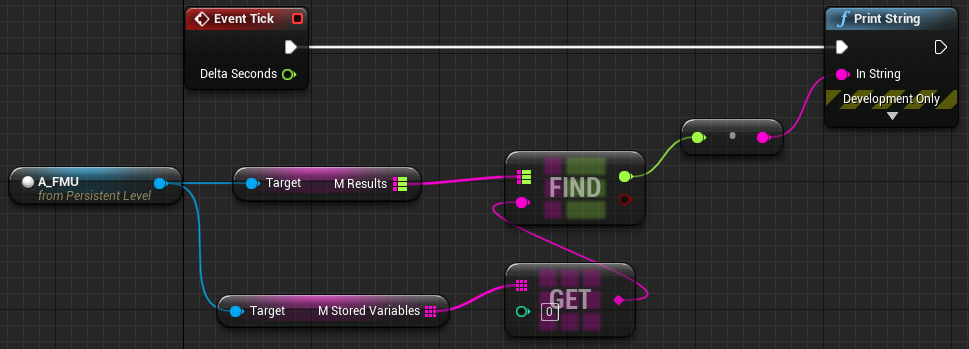

# Unreal Engine - FMI Plugin (UEFMI)

[](https://youtu.be/r3NeJKJt4Z8)

# Background
- The UEFMI plugin allows for the use of dynamic simulation models via Functional Mockup Units (FMUs) directly in an Unreal Engine project.
- An FMU is code that has been packaged according to the [Functional Mockup Interface](https://fmi-standard.org/), a free and open-source standard for exchanging dynamic (i.e., time-dependent) simulation models.
- Common examples of models that get packaged into FMUs are:
  - Physics based vehicle simulators (e.g., drive train, HVAC, water vehicles, etc.)
  - Energy systems (e.g., power plants, buildings)
  - Space systems (e.g., solar sail mechanics, propulsion systems)
  - And many many more...

# Prerequisites

This work was tested using the following. It may work on something else but no guarantees.
- Windows 10
- Unreal Engine 5.1+
- Visual Studio 2022
- **An unzip utility on path, currently supported are unzip, 7z, tar**

# `A_FMU` -> The Workhorse

`A_FMU` under [`UEFMI C++ Classes/UEFMI/Public`](./Source/UEFMI/Private/A_FMU.cpp) contains the magic to make the FMU run. Users are highly encouraged to look at `A_FMU.cpp` if they need to understand more intimately the implementation. A couple important notes are:
- `PathFMU` is the location of the FMU and supports relative or absolute paths. 
- `mResults` returns the results requested from the variables added to `mStoredVariables`.
  - `mResults` only returns values when `mAutoSimulateTick` = True. Else it is empty and variables must be be retrieved using the `GetReal()` function.
- `mModelVariables` are the names of all availble variables found in the model which could be added to `mStoredVariables`.

# Installation

> As a plugin, UEFMI is intended to be used inside an existing Unreal Engine project!

The process below will go through the steps to adding the plugin to a new Unreal Engine project.

1. Create an Unreal Engine project. Fror illustration purposes let's call it `MYPROJECT`.
    - Go to the project `MYPROJECT` folder and create a `Plugins` folder if it doesn't exist.
    ```
    cd MYPROJECT
    mkdir Plugins
    ```

1. Clone the repository and submodules. To do that, in the ``MYPROJECT/Plugins` folder:
   ```
   cd Plugins
   git clone https://github.com/ORNL-Modelica/UnrealEngine-FMIPlugin.git UEFMI
   cd UEFMI
   git submodule init
   git submodule update
   ```
   - Note:
     - `git submodule update --remote` to grab the latest commits instead of specific commit
1. Copy the files from the submodule to the `UEFMI` plugin source folder (choose one option). In `MYPROJECT/Plugins/UEFMI` folder:
   - **Auto**: 
     - Run `setup.bat` (Windows) or `setup.sh` (Linux)
   - **Manual**:
     - Copy files: <br>`FMU.cpp`, `FMU1.cpp`, `FMU2.cpp` 
     - From: <br> `ThirdParty/fmikit/src`
     - To: <br> `Source/UEFMI/ThirdParty/fmikit/src`
1. Run the Unreal Engine project
   - Double click `MYPROJECT.uproject` and rebuild the plugin if prompted.
   - Or right-click `MYPROJECT.uproject` and select `Generate Visual Studio project files` and then open `MYPROJECT.sln`

## Test Installation

These examples use the `test.fmu` included in the repo. The FMU provided will be extracted to a temporary folder called `fmus` at the top level of the UE project folder.

> `test.fmu` is a [Lorenz System model](https://en.wikipedia.org/wiki/Lorenz_system) model created from the Modelica source code [test.mo](./src/test.mo)

- `Level_0`
  - This level provides example blueprints (`BP_FMU`) demonstrating the automatic and manual options for simulating an FMU.
  - `BP_FMU` implements the `A_FMU` class.
- `Level_1`
  - Simple use of  `A_FMU` and printing a variable to the screen via the level blueprint.

# Known Issues

- Currently only floats and booleans (i.e., 0/1) are supported variables in `A_FMU`.
- Has not yet been tested on non-Windows OS.

# License

Copyright 2019 UT-Battelle. The code is released under the [Apache License, Version 2.0](http://www.apache.org/licenses/LICENSE-2.0).