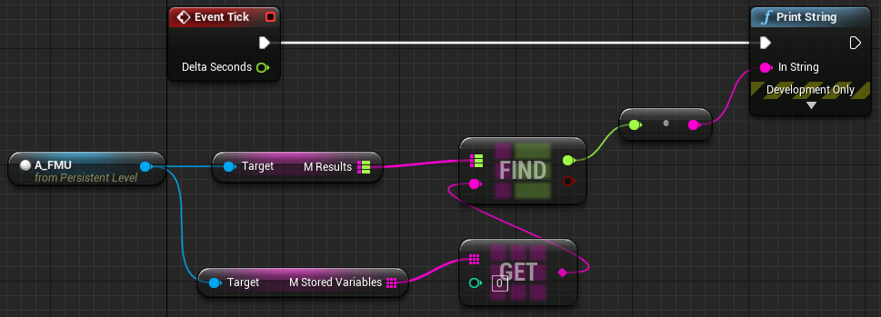

# Unreal Engine - FMI Plugin (UEFMI)

# Background
- An interface for interacting with Functional Mockup Units (FMUs) in Unreal Engine.
  -  An FMU is code that has been packaged according to the [Functional Mockup Interface[(https://fmi-standard.org/)], a free and open-source standard for exchanging dynamic (i.e., time-dependent) simulation models.
- The UEFMI plugin allows the use of dynamic simulation models directly in a Unreal Engine project.

# Prerequisites

This work was tested using the following. It may work on something else but no guarantees.
- Windows 10
- Unreal Engine 5.3+
- Visual Studio 2022
- **An unzip utility on path, currently supported are unzip, 7z, tar**

# `A_FMU` -> The Workhorse

`A_FMU` under [`UEFMI C++ Classes/UEFMI/Public`](./DemoUEFMIPlugin/Plugins/UEFMI/Source/UEFMI/Private/A_FMU.cpp) contains the magic to make the FMU run. Users are highly encouraged to look at `A_FMU.cpp` if they need to understand more intimately the implementation. A couple important notes are:
- `PathFMU` is the location of the FMU and supports relative or absolute paths. 
- `mResults` returns the results requested from the variables added to `mStoredVariables`.
  - `mResults` only returns values when `mAutoSimulateTick` = True. Else it is empty and variables must be be retrieved using the `GetReal()` function.
- `mModelVariables` are the names of all availble variables found in the model which could be added to `mStoredVariables`.

# Installation

This repostory provides the plugin ready to be used in an example project. To use in a new project, copy and paste the the `UEFMI` plugin folder (at `DemoUEFMIPlugin/Plugins/UEFMI`) into the `Plugin` folder of your project.

To get this project use one of the following methods:
 - Method 1 - manual copying of third party files.
 - Method 2 - symbolic links (can be tricky. So if you are not familiar with them it is recommended to use Method 1.)

**Method 1**
1. Clone the repository with FMIKit submodule
   - `git clone https://github.com/ORNL-Modelica/UnrealEngine-FMIPlugin.git`
   - `cd` to repo
   - `git submodule init`
   - `git submodule update`
       - `git submodule update --remote` to grab the latest commits instead of specific commit
1. Replace the symbolic links with c++ code
   - From:   `UnrealEngine-FMIPlugin/DemoUEFMIPlugin/Plugins/FMIKit/ThirdParty/fmikit/src`
       - Copy the files `FMU.cpp`, `FMU1.cpp`, and `FMU2.cpp` 
   - To:   `UnrealEngine-FMIPlugin/DemoUEFMIPlugin/Plugins/FMIKit/Source/FMIKit/ThirdParty/fmikit/src`
       - Replace the files in which have the same names
1. Launch the `DemoUEFMIPlugin.uproject` rebuilding the project when prompted.
  
**Method 2**
1. Clone the repository
  - `git submodule update --init`
  - FMU[1/2].cpp are symlinks 
    - copy the submodule files over the links (text files) **OR**
    - it may be necessary to turn `symlinks = true` in `.git/config`.
    - it may be necessary to have installed git with enable symlinks.
    - it may be necessary to clone or run "`git reset HEAD --hard`" as administrator 
- Open the project `DemoUEFMIPlugin.uproject` by double-clicking the file.
- When prompted, rebuild the project click `Yes`.
  - The project will build and then launch Unreal Engine.

## Test Installation

These examples use the `test.fmu` included in the repo. The FMU provided will be extracted to a temporary folder called `fmus` at the top level of the UE project folder.

> `test.fmu` is a [Lorenz System model](https://en.wikipedia.org/wiki/Lorenz_system) model created from the Modelica source code [test.mo](./src/test.mo)

- `Level_0`
  - This level provides example blueprints (`BP_FMU`) demonstrating the automatic and manual options for simulating an FMU.
  - `BP_FMU` implements the `A_FMU` class.
- `Level_1`
  - Simple use of  `A_FMU` and printing a variable to the screen via the level blueprint.

# Known Issues

- Currently only floats and booleans (i.e., 0/1) are supported variables in `A_FMU`.
- Has not yet been tested on non-Windows OS.

# License

Copyright 2019 UT-Battelle. The code is released under the [Apache License, Version 2.0](http://www.apache.org/licenses/LICENSE-2.0).